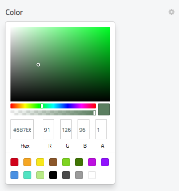

# Storyblok ColorPicker Plugin

> shows a colorpicker to select a color value 

## Usage

- Visit: `https://app.storyblok.com/#!/me/plugins`
- Click the *New* button
- Paste the code from `index.js` and save it
- Edit your content and add a new field with the type *Other* and type `colorpicker` in the appearing *Custom type* field

## Planned Features

- Transpile to ES5
- Fixed palette for predefined colors

## Uses

- uses Sketch colorpicker from `https://www.npmjs.com/package/vue-color`

